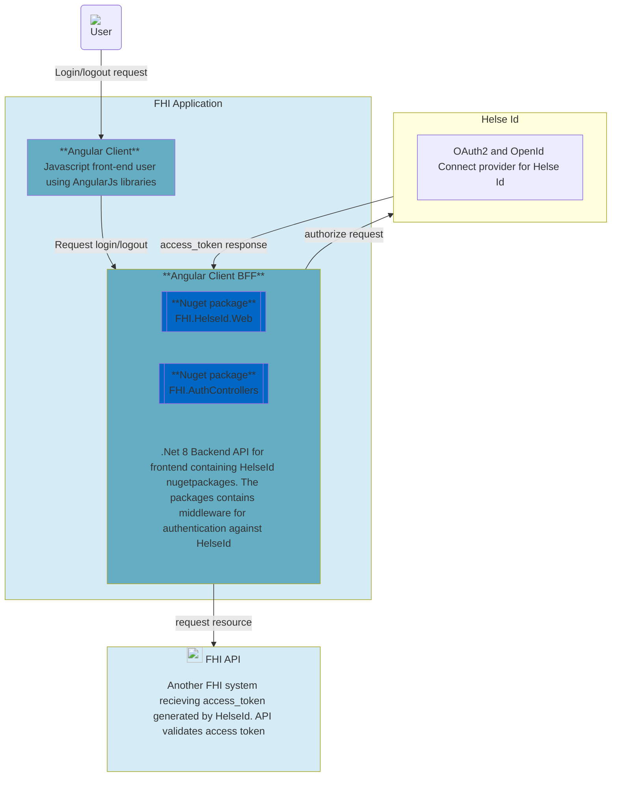

# Description

This sample uses Angular and ASP .Net Core BFF (backend for frontend). The sample uses [FHI.HelseId](https://github.com/FHIDev/fhi.helseid/wiki) nuget packages for authentication with [NHN Helse Id](https://utviklerportal.nhn.no/informasjonstjenester/helseid/)
## Technology
- ASP .Net Core
- Node

## Overview of sample application architecture

### Login flow

### Logout flow

### Silent renew flow
